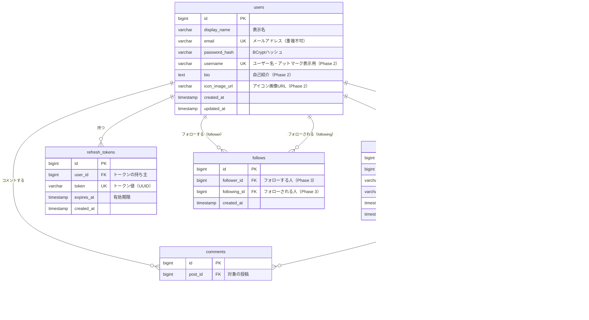

# データベース設計書

## RaiseTimeLine（仮称）

ER図・テーブル定義・インデックス設計を定義する。
API設計は [設計書（design.md）](./design.md) を参照。

---

## 1. ER図

> ER図（Entity Relationship Diagram）＝「テーブル同士がどうつながっているか」を表した図。
> `||--o{` は「1対多」（例：1人のユーザーが多数の投稿を持つ）を意味する。GitHub上で自動的に図として表示される。

> 本ER図は**最終形（目標スキーマ）**を描いている。Phase 1 で作らないものには「Phase 2」「Phase 3」と明記した。
> 実装はマイグレーション（後述）で段階的にこの形に近づける。

### 設計のポイント（学習メモ）

1. **いいね数・コメント数は列として持たない。**
   `likes` / `comments` の行数を COUNT で数えて算出する（導出値）。
   数を列に持つと「実際の行数と数字がずれる」事故が起きるため、まずは都度集計が安全。
   （大規模SNSでは高速化のためにカウンタ列を持つこともある＝カウンタキャッシュ。今回は発展知識として知っておくだけでよい）
2. **二重いいねはDBの制約で防ぐ。**
   `likes` に（post_id, user_id）の**ユニーク制約**を張る。アプリのコードでチェックしても、
   同時リクエスト（連打）はすり抜けることがあるため、最後の砦はDBに置く。
3. **外部キー（FK）で「存在しない投稿へのコメント」を防ぐ。**
   comments.post_id は posts.id を参照する外部キーにする。親の投稿が消えたら
   コメント・いいねも一緒に消えるように `ON DELETE CASCADE` を設定する（Phase 2 の投稿削除で効いてくる）。
4. **follows は「users と users を結ぶ中間テーブル」（Phase 3）。**
   likes が users×posts を結ぶのと同じ仕組みの users×users 版。
   （follower_id, following_id）のユニーク制約で二重フォローを防ぐのも likes と同じパターン。
   既存テーブルに手を入れず追加できるため、Phase 3 での実装でも手戻りは発生しない。

---

## 2. テーブル定義

### users（ユーザー）

| カラム名 | 型 | NULL | デフォルト | 説明 |
|---------|----|------|-----------|------|
| id | BIGSERIAL | 不可 | 自動採番 | 主キー |
| display_name | VARCHAR(50) | 不可 | - | 表示名（タイムラインに表示される名前） |
| email | VARCHAR(255) | 不可 | - | メールアドレス（ログインID）。ユニーク制約 |
| password_hash | VARCHAR(255) | 不可 | - | BCryptでハッシュ化したパスワード |
| username | VARCHAR(30) | 不可 | - | @表示用のユーザー名。ユニーク制約（**Phase 2 で追加**。追加時に既存ユーザーへ値を割り当てるマイグレーションが必要） |
| bio | TEXT | 可 | NULL | 自己紹介（**Phase 2 で追加**） |
| icon_image_url | VARCHAR(512) | 可 | NULL | アイコン画像のURL（**Phase 2 で追加**） |
| created_at | TIMESTAMP | 不可 | CURRENT_TIMESTAMP | 作成日時 |
| updated_at | TIMESTAMP | 不可 | CURRENT_TIMESTAMP | 更新日時 |

### posts（投稿）

| カラム名 | 型 | NULL | デフォルト | 説明 |
|---------|----|------|-----------|------|
| id | BIGSERIAL | 不可 | 自動採番 | 主キー |
| user_id | BIGINT | 不可 | - | 投稿者。users.id への外部キー |
| content | VARCHAR(280) | 不可 | - | 本文（1〜280文字。アプリ側でもバリデーション） |
| image_path | VARCHAR(255) | 可 | NULL | 添付画像の保存パス（画像なしの場合は NULL） |
| created_at | TIMESTAMP | 不可 | CURRENT_TIMESTAMP | 投稿日時（タイムラインの並び順に使用） |
| updated_at | TIMESTAMP | 不可 | CURRENT_TIMESTAMP | 更新日時（Phase 2 の編集機能で使用） |

### comments（コメント）

| カラム名 | 型 | NULL | デフォルト | 説明 |
|---------|----|------|-----------|------|
| id | BIGSERIAL | 不可 | 自動採番 | 主キー |
| post_id | BIGINT | 不可 | - | 対象の投稿。posts.id への外部キー（ON DELETE CASCADE） |
| user_id | BIGINT | 不可 | - | コメントしたユーザー。users.id への外部キー |
| content | VARCHAR(280) | 不可 | - | コメント本文（1〜280文字） |
| created_at | TIMESTAMP | 不可 | CURRENT_TIMESTAMP | コメント日時 |

### likes（いいね）

| カラム名 | 型 | NULL | デフォルト | 説明 |
|---------|----|------|-----------|------|
| id | BIGSERIAL | 不可 | 自動採番 | 主キー |
| post_id | BIGINT | 不可 | - | 対象の投稿。posts.id への外部キー（ON DELETE CASCADE） |
| user_id | BIGINT | 不可 | - | いいねしたユーザー。users.id への外部キー |
| created_at | TIMESTAMP | 不可 | CURRENT_TIMESTAMP | いいねした日時 |

> **ユニーク制約:** (post_id, user_id) — 同じユーザーが同じ投稿に2回いいねできない

### refresh_tokens（リフレッシュトークン）

| カラム名 | 型 | NULL | デフォルト | 説明 |
|---------|----|------|-----------|------|
| id | BIGSERIAL | 不可 | 自動採番 | 主キー |
| user_id | BIGINT | 不可 | - | トークンの持ち主。users.id への外部キー（ON DELETE CASCADE） |
| token | VARCHAR(255) | 不可 | - | トークン値（UUID）。ユニーク制約 |
| expires_at | TIMESTAMP | 不可 | - | 有効期限（期限切れトークンは使用不可） |
| created_at | TIMESTAMP | 不可 | CURRENT_TIMESTAMP | 発行日時 |

### follows（フォロー関係）※Phase 3 で作成

| カラム名 | 型 | NULL | デフォルト | 説明 |
|---------|----|------|-----------|------|
| id | BIGSERIAL | 不可 | 自動採番 | 主キー |
| follower_id | BIGINT | 不可 | - | フォローする人。users.id への外部キー（ON DELETE CASCADE） |
| following_id | BIGINT | 不可 | - | フォローされる人。users.id への外部キー（ON DELETE CASCADE） |
| created_at | TIMESTAMP | 不可 | CURRENT_TIMESTAMP | フォローした日時 |

> **ユニーク制約:** (follower_id, following_id) — 同じ相手を2回フォローできない
> **CHECK制約:** follower_id ≠ following_id — 自分自身はフォローできない

---

## 3. 列挙値（Enum）の定義

現時点で固定値カラムはなし。
（Phase 3 のフォロー機能や将来の通知機能を実装する際に、通知種別などで必要になる可能性がある）

---

## 4. インデックス設計

> インデックス＝本の「索引」。検索を速くする仕組み。よく検索条件・並び替えに使う列に張る。

| テーブル | カラム | 種別 | 理由 |
|---------|--------|------|------|
| users | email | UNIQUE | ログイン時にメールアドレスで検索する。重複防止も兼ねる |
| posts | created_at | INDEX | タイムラインは常に「新着順」で並べるため |
| posts | user_id | INDEX | Phase 2 のプロフィール画面で「特定ユーザーの投稿一覧」を取得するため |
| comments | post_id | INDEX | 投稿詳細でその投稿のコメントを取得する・コメント数を数えるため |
| likes | (post_id, user_id) | UNIQUE | 二重いいね防止。post_id での検索（いいね数の集計）にも使える |
| refresh_tokens | token | UNIQUE | トークン再発行時にトークン値で検索するため |
| users | username | UNIQUE | @ユーザー名の重複防止・検索用（**Phase 2**） |
| follows | (follower_id, following_id) | UNIQUE | 二重フォロー防止。follower_id での検索（フォロー中一覧）にも使える（**Phase 3**） |
| follows | following_id | INDEX | 「自分のフォロワー一覧」を取得するため（**Phase 3**） |

---

## 5. マイグレーション実行順序（Flyway）

> Flyway は `V1__xxx.sql` のような連番ファイルを順番に実行して、DBの状態をバージョン管理するツール。
> 外部キーの参照先（親テーブル）を先に作る必要があるため、順序が重要。

### 実装済み（認証フェーズ）

| 順序 | ファイル名 | 内容 |
|------|------------------|------|
| V1 | V1__create_users.sql | users テーブル作成（Phase 1 時点のカラムのみ） |
| V2 | V2__create_refresh_tokens.sql | refresh_tokens テーブル作成（users を参照） |

> **旧計画からの変更点:** 当初はPhase 1の全テーブル（users→posts→comments→likes→refresh_tokens→シードユーザー）を
> 一気に作る計画だったが、認証機能を先行実装したため **V1・V2のみを先に作成**した。
> posts等は次フェーズでV3〜として追加する（Flywayは「必要になった時点のスキーマだけ積む」のが原則）。
> また、ユーザー登録（signup）APIが先行実装されたことで自分でテストユーザーを登録できるようになったため、
> **シードユーザー投入（旧V6）は作らないことにした**（BCryptハッシュのSQL直書きは学習上の混乱を招くだけと判断）。

### Phase 1 継続分・Phase 2 以降（予定。実装フェーズで番号・内容を確定する）

| 順序 | ファイル名（予定） | 内容 | Phase |
|------|------------------|------|-------|
| V3 | V3__create_posts.sql | posts テーブル作成（users を参照） | 1 |
| V4 | V4__create_comments.sql | comments テーブル作成（users, posts を参照） | 1 |
| V5 | V5__create_likes.sql | likes テーブル作成＋ユニーク制約（users, posts を参照） | 1 |
| V6 | V6__add_profile_columns_to_users.sql | users に username / bio / icon_image_url を追加（既存ユーザーへの username 割り当てを含む） | 2 |
| V7 | V7__create_follows.sql | follows テーブル作成＋ユニーク制約・CHECK制約 | 3 |

> **学習メモ:** ER図は最初に最終形（目標スキーマ）まで描き切るが、テーブルやカラムの追加は
> このように後続のマイグレーションで行う。「一度実行したマイグレーションファイルは書き換えず、
> 変更は新しいファイルで積み重ねる」のが Flyway の基本ルール。
