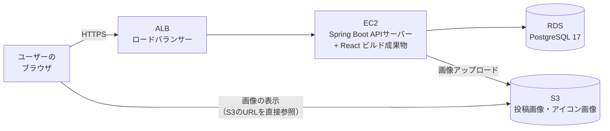

# インフラ構成図（前提版）

## RaiseTimeLine（仮称）

| 項目 | 内容 |
|------|------|
| ステータス | **前提構成**（サーバー構築方式の詳細はデプロイフェーズで確定する） |
| 確定事項 | 画像保存に **AWS S3** を使用する |
| 前提事項 | EC2 + RDS（PostgreSQL） + ALB（ロードバランサー）を使用する |

> 本書は要件定義時点の「前提となる構成図」。デプロイフェーズで、
> 具体的なネットワーク設計（VPC・サブネット）・セキュリティグループ・デプロイ手順を追記して確定させる。

---

## 1. 構成図（前提）

### 各コンポーネントの役割

| コンポーネント | 役割 | 補足 |
|--------------|------|------|
| ALB（Application Load Balancer） | ユーザーからのリクエストを受け、EC2 に振り分ける入口 | HTTPS の終端（SSL証明書）もここで担う想定 |
| EC2 | Spring Boot（REST API）を動かすサーバー | React のビルド成果物の配信方法は下記「未確定事項」参照 |
| RDS（PostgreSQL） | データベースのマネージドサービス | バックアップ・パッチ適用を AWS が管理してくれる |
| S3 | 画像ファイルの保存先（**確定**） | 投稿画像・アイコン画像を保存。画像はS3のURLで直接配信する想定 |

> **ロードバランサーを入れる理由（学習メモ）:** 本来は複数サーバーへの負荷分散が目的だが、
> サーバー1台でも「HTTPSの終端」「ヘルスチェック」「将来の台数追加への備え」として入れる構成が実務では一般的。

---

## 2. ローカル開発環境との対応

| 役割 | ローカル開発 | 本番（前提） |
|------|-------------|------------|
| フロントエンド | Vite 開発サーバー（ポート3000） | ビルド成果物を配信（方法は未確定） |
| バックエンド | Spring Boot（ポート8080） | EC2 上の Spring Boot |
| データベース | Docker の PostgreSQL 17（ポート5432） | RDS（PostgreSQL 17） |
| 画像保存 | 環境構築時に決定（ローカル保存 or 開発用S3バケット） | S3（確定） |

---

## 3. 未確定事項（デプロイフェーズで決定）

| # | 未確定事項 | 選択肢の例 |
|---|-----------|-----------|
| 1 | React ビルド成果物の配信方法 | EC2上のnginxで配信 / S3 + CloudFront で配信 |
| 2 | サーバー構築の方式 | EC2に手動構築 / Terraform でコード管理（前回課題はTerraform） |
| 3 | 独自ドメイン・DNS | Route 53 を使うか、ALBのDNS名をそのまま使うか |
| 4 | S3への画像アップロード方式 | バックエンド経由でアップロード / 署名付きURLでブラウザから直接アップロード |

---

## 4. デプロイ手順

デプロイフェーズで追記する（未作成）。
