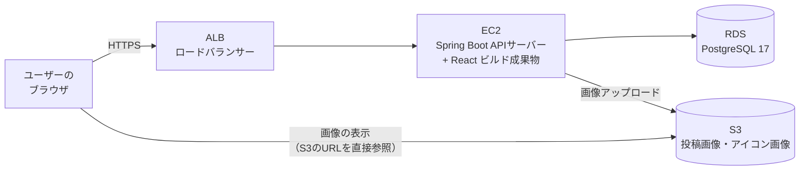

# インフラ構成図（前提版）

## RaiseTimeLine（仮称）

| 項目 | 内容 |
|------|------|
| ステータス | **前提構成**（サーバー構築方式の詳細はデプロイフェーズで確定する） |
| 確定事項 | 画像保存に **AWS S3** を使用する（**2026-09-02 実装完了**。詳細は「5. S3の確定仕様」） |
| 前提事項 | EC2 + RDS（PostgreSQL） + ALB（ロードバランサー）を使用する |

> 本書は要件定義時点の「前提となる構成図」。デプロイフェーズで、
> 具体的なネットワーク設計（VPC・サブネット）・セキュリティグループ・デプロイ手順を追記して確定させる。
> **S3の部分のみ、実際のリソースを作成して確定済み。**

---

## 1. 構成図（前提）

```mermaid
graph LR
    U[ユーザーの<br>ブラウザ] -->|HTTPS| ALB[ALB<br>ロードバランサー]
    ALB --> EC2[EC2<br>Spring Boot APIサーバー<br>+ React ビルド成果物]
    EC2 --> RDS[(RDS<br>PostgreSQL 17)]
    EC2 -->|画像アップロード| S3[(S3<br>投稿画像・アイコン画像)]
    U -->|画像の表示<br>（S3のURLを直接参照）| S3
```

### 各コンポーネントの役割

| コンポーネント | 役割 | 補足 |
|--------------|------|------|
| ALB（Application Load Balancer） | ユーザーからのリクエストを受け、EC2 に振り分ける入口 | HTTPS の終端（SSL証明書）もここで担う想定 |
| EC2 | Spring Boot（REST API）を動かすサーバー | React のビルド成果物の配信方法は下記「未確定事項」参照 |
| RDS（PostgreSQL） | データベースのマネージドサービス | バックアップ・パッチ適用を AWS が管理してくれる |
| S3 | 画像ファイルの保存先（**確定**） | 投稿画像・アイコン画像を保存。画像はS3のURLで直接配信する想定 |

> **ロードバランサーを入れる理由（学習メモ）:** 本来は複数サーバーへの負荷分散が目的だが、
> サーバー1台でも「HTTPSの終端」「ヘルスチェック」「将来の台数追加への備え」として入れる構成が実務では一般的。

---

## 2. ローカル開発環境との対応

| 役割 | ローカル開発 | 本番（前提） |
|------|-------------|------------|
| フロントエンド | Vite 開発サーバー（ポート5173） | ビルド成果物を配信（方法は未確定） |
| バックエンド | Spring Boot（ポート8080） | EC2 上の Spring Boot |
| データベース | Docker の PostgreSQL 17（ポート5432） | RDS（PostgreSQL 17） |
| 画像保存 | 既定は**ローカル保存**（`backend/uploads/`）。`APP_STORAGE_TYPE=s3` でS3にも切替可能 | S3（確定） |

---

## 3. 未確定事項（デプロイフェーズで決定）

| # | 未確定事項 | 選択肢の例 |
|---|-----------|-----------|
| 1 | React ビルド成果物の配信方法 | EC2上のnginxで配信 / S3 + CloudFront で配信 |
| 2 | サーバー構築の方式 | EC2に手動構築 / Terraform でコード管理（前回課題はTerraform） |
| 3 | 独自ドメイン・DNS | Route 53 を使うか、ALBのDNS名をそのまま使うか |

> **旧「S3への画像アップロード方式」は確定した**（バックエンド経由）。下記「5. S3の確定仕様」を参照。

---

## 4. デプロイ手順

デプロイフェーズで追記する（未作成）。

---

## 5. S3の確定仕様（2026-09-02 実装・実機検証済み）

### リソース

| 項目 | 値 |
|------|-----|
| バケット名 | `raisetimeline-dev-578760237100` |
| リージョン | `ap-northeast-1`（東京） |
| バージョニング | **無効**（有効だと削除しても実体が残り、課金が積み上がるため） |
| 暗号化 | S3の既定（`AES256`）をそのまま使用 |
| IAMユーザー | `raisetimeline-app`（アプリ専用。`Administrator` は使わない） |
| IAMポリシー | `RaiseTimeLineS3Access` |

> バケット名にアカウントIDを含めているのは、S3のバケット名が**全世界で一意**である必要があるため。

### IAMポリシー（最小権限）

対象バケット以外には一切アクセスできない。

| 許可 | 対象 |
|------|------|
| `s3:PutObject` / `s3:GetObject` / `s3:DeleteObject` | `arn:aws:s3:::raisetimeline-dev-578760237100/*` |
| `s3:ListBucket` | `arn:aws:s3:::raisetimeline-dev-578760237100` |

`s3:ListAllMyBuckets` や IAM 操作の権限は与えていない（実際に拒否されることを検証済み）。

### 公開方針

| 設定 | 値 | 理由 |
|------|-----|------|
| `BlockPublicAcls` / `IgnorePublicAcls` | **true（塞いだまま）** | ACLによる意図しない公開を防ぐ |
| `BlockPublicPolicy` / `RestrictPublicBuckets` | false | バケットポリシーで読み取りのみ許可するため |
| バケットポリシー | `s3:GetObject` のみ匿名許可 | `` はブラウザが認証情報を送れないため |

**受け入れたトレードオフ:** URLを知っていればログインなしで画像を閲覧できる。
バケットの一覧取得は匿名に許可していないためキーの推測はできないが、
「投稿画像はURLさえあれば誰でも見られる」状態であることを前提とする。

- **却下案: 署名付きURL（presigned URL）** — より安全だが、`StorageService#toPublicUrl(String): String` に
  有効期限を表現できずシグネチャが合わない。呼ぶたびURLが変わるためブラウザの画像キャッシュも効かなくなる

### アプリ側の切り替え

| 環境 | 設定 | 認証情報 |
|------|------|---------|
| 通常のローカル開発 | **何も設定しない**（既定で `local`） | AWSの認証情報すら不要 |
| ローカルでS3を検証 | `APP_STORAGE_TYPE=s3` / `APP_STORAGE_S3_BUCKET=...` | `AWS_PROFILE=raisetimeline` |
| 将来のEC2 | 同上 | **IAMロール**（アクセスキー自体が不要になる） |

`DefaultCredentialsProvider` が「環境変数 → プロファイル → EC2のIAMロール」の順で自動探索するため、
**3環境すべてでコードは同一**。アクセスキーは `~/.aws/credentials`（リポジトリ外）にのみ置く。

### コスト管理

既存の AWS Budgets「AWSコスト上限アラート」（月$1・**実績が$0.01を超えた時点で**メール通知）を見張りに使う。
計画時は $5 のBudgetを新設する予定だったが、既存のものの方が条件が厳しいため新設は見送った。
