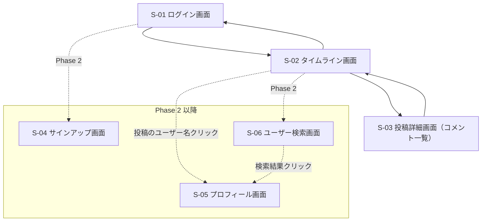
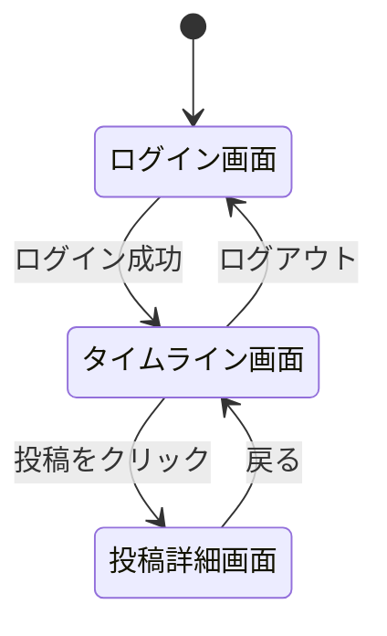

# 画面設計書

## RaiseTimeLine（仮称）

画面一覧・画面遷移・ワイヤーフレーム・デザイン方針を定義する。
機能の詳細は [機能一覧（features.md）](./features.md) を参照。

---

## 1. 画面一覧

| # | 画面名 | 主な要素 | Phase |
|---|--------|---------|-------|
| S-01 | ログイン画面 | メールアドレス・パスワード入力、ログインボタン、エラーメッセージ | 1 |
| S-02 | タイムライン画面 | 投稿フォーム（本文＋画像選択）、投稿一覧（新着順）、いいね・コメント数、ログアウト。Phase 3 で「全体／フォロー中」の切替タブを追加 | 1 |
| S-03 | 投稿詳細画面 | 投稿本文・画像、コメント一覧、コメント入力フォーム、いいねボタン | 1 |
| S-04 | サインアップ画面 | メールアドレス・表示名・パスワード入力、登録ボタン | 2 |
| S-05 | プロフィール画面 | アイコン・表示名・@ユーザー名・自己紹介・そのユーザーの投稿一覧。Phase 3 でフォローボタン・フォロー/フォロワー数を追加 | 2 |
| S-06 | ユーザー検索画面 | 検索ボックス、ユーザー検索結果一覧（クリックでプロフィールへ遷移） | 2 |

---

## 2. 画面構成図



### 初期表示

- 未ログイン時は必ず **ログイン画面** が表示される（タイムラインのURLに直接アクセスしてもログイン画面へリダイレクト）
- ログイン済みであれば **タイムライン画面** が初期表示となる

---

## 3. 画面遷移図



---

## 4. ワイヤーフレーム

### WF-01: ログイン画面（S-01）

```
+--------------------------------------------------+
|                                                  |
|                  RaiseTimeLine                   |
|                                                  |
|   +------------------------------------------+   |
|   |  メールアドレス                           |   |
|   +------------------------------------------+   |
|   +------------------------------------------+   |
|   |  パスワード                               |   |
|   +------------------------------------------+   |
|                                                  |
|   [            ログイン            ]             |
|                                                  |
|   （エラー時：メールアドレスまたは                |
|     パスワードが正しくありません）                |
|                                                  |
+--------------------------------------------------+
```

### WF-02: タイムライン画面（S-02）

```
+--------------------------------------------------+
|  RaiseTimeLine                     [ログアウト]   |
+--------------------------------------------------+
|  +--------------------------------------------+  |
|  | いまどうしてる？                            |  |
|  |                                            |  |
|  | [📷 画像を選択]          140/280  [投稿する] |  |
|  +--------------------------------------------+  |
|                                                  |
|  +--------------------------------------------+  |
|  | 鈴木さん ・ 5分前                           |  |
|  | 今日はSpring Securityの講義。JWTむずかしい…  |  |
|  |                                            |  |
|  | 💬 3    ♡ 12                               |  |
|  +--------------------------------------------+  |
|  +--------------------------------------------+  |
|  | 高橋さん ・ 1時間前                          |  |
|  | 週末に撮った写真です                         |  |
|  | +----------------------------------------+ |  |
|  | |               （画像）                  | |  |
|  | +----------------------------------------+ |  |
|  | 💬 1    ❤ 8   ←（いいね済みは塗りつぶし）    |  |
|  +--------------------------------------------+  |
|                                                  |
|  [ もっと見る（次のページを読み込み） ]           |
+--------------------------------------------------+
```

### WF-03: 投稿詳細画面（S-03）

```
+--------------------------------------------------+
|  ← 戻る                                          |
+--------------------------------------------------+
|  +--------------------------------------------+  |
|  | 鈴木さん ・ 5分前                           |  |
|  | 今日はSpring Securityの講義。JWTむずかしい…  |  |
|  | 💬 3    ♡ 12                               |  |
|  +--------------------------------------------+  |
|                                                  |
|  +--------------------------------------------+  |
|  | コメントを入力…                  [コメント]  |  |
|  +--------------------------------------------+  |
|                                                  |
|  --- コメント一覧（3件）------------------------  |
|  | 高橋さん ・ 3分前                           |  |
|  | 私も最初は苦戦しました！                     |  |
|  +--------------------------------------------+  |
|  | 佐藤さん ・ 1分前                           |  |
|  | 図に書くと理解しやすいですよ                 |  |
|  +--------------------------------------------+  |
+--------------------------------------------------+
```

> S-04（サインアップ画面）・S-05（プロフィール画面）・S-06（ユーザー検索画面）のワイヤーフレームは Phase 2 着手前に追加する。
> S-02 のタブ切替（全体／フォロー中）のワイヤーフレーム更新は Phase 3 着手前に行う。

---

## 5. デザイン方針

### カラーパレット

| 用途 | 色 | 補足 |
|------|----|----|
| ベース | 白（#FFFFFF）/ ごく薄いグレー（#F7F9F9） | X のライトテーマを参考にした清潔感のある背景 |
| テキスト | ダークグレー（#0F1419） | 真っ黒より目に優しい |
| アクセント | ブルー（#1D9BF0 系） | ボタン・リンク・アクティブ状態 |
| いいね | ピンク／レッド（#F91880 系） | いいね済み状態の表現 |

### UIコンポーネント方針

- Tailwind CSS をベースにユーティリティクラスでスタイリングする
- タイムラインは**中央1カラム（最大幅 600px 程度）**のカード型リストとする（X と同じ読みやすいレイアウト）
- いいね・コメントのアイコンは投稿カードの下部に横並びで配置し、数を隣に表示する
- ローディング中・エラー時の状態表示を必ず用意する（真っ白な画面にしない）
- 文字数カウンター（残り文字数）を投稿フォームに表示する
