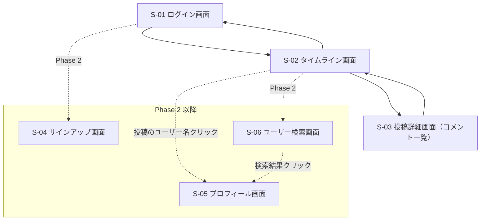
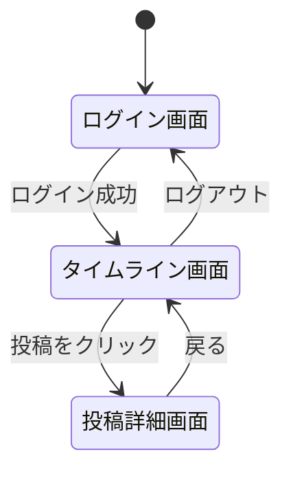

# 画面設計書

## RaiseTimeLine（仮称）

画面一覧・画面遷移・ワイヤーフレーム・デザイン方針を定義する。
機能の詳細は [機能一覧（features.md）](./features.md) を参照。

---

## 1. 画面一覧

| # | 画面名 | 主な要素 | Phase |
|---|--------|---------|-------|
| S-01 | ログイン画面 | メールアドレス・パスワード入力、ログインボタン、エラーメッセージ | 1 |
| S-02 | タイムライン画面 | ヘッダー（ロゴ・検索/プロフィールボタン・ログアウト）、タブバー（全体／フォロー中。フォロー中はPhase 3まで無効化）、「＋投稿する」ボタン（モーダルで投稿作成）、投稿一覧（新着順、スクロールで自動読み込み）、いいね・コメント数、自分の投稿の編集・削除ボタン | 1 |
| S-03 | 投稿詳細画面 | 投稿本文・画像、コメント一覧、コメント入力フォーム、いいねボタン | 1 |
| S-04 | サインアップ画面 | メールアドレス・表示名・パスワード入力、登録ボタン | 2 |
| S-05 | プロフィール画面 | アイコン・表示名・@ユーザー名・自己紹介・そのユーザーの投稿一覧（スクロールで自動読み込み）。自分のページのみ「プロフィール編集」ボタン。Phase 3 でフォローボタン・フォロー/フォロワー数を追加 | 2 |
| S-06 | ユーザー検索画面 | 検索ボックス、ユーザー検索結果一覧（クリックでプロフィールへ遷移） | 2 |
| S-08 | プロフィール編集画面 | アイコン画像の変更、表示名・@ユーザー名・自己紹介の入力、保存ボタン | 2 |

---

## URL設計（画面のパス）

| 画面 | パス | 認証 |
|------|------|------|
| S-01 ログイン | `/login` | 不要 |
| S-04 サインアップ | `/signup` | 不要 |
| S-02 タイムライン | `/timeline` | 必要 |
| S-03 投稿詳細 | `/posts/:id` | 必要 |
| S-05 プロフィール | `/users/:username` | 必要 |
| S-08 プロフィール編集 | `/profile/edit` | 必要 |

> **プロフィールのパスに id ではなく @ユーザー名 を使う理由:** URLを見ただけで誰のページか分かり、
> 共有もしやすいため（X/Twitter と同じ考え方）。`username` にはユニーク制約があるので一意に特定できる。
> 副作用として、**@ユーザー名を変更すると旧URLは404になる**（Xと同じ挙動として許容している）。

> **編集画面のパスに `:username` を入れない理由:** 編集対象がその `username` 自身であるため。
> `/users/:username/edit` にすると、保存した瞬間にURLが古い名前を指す状態になってしまう。

---

## 2. 画面構成図


```mermaid
graph TD
    A[S-01 ログイン画面] --> B[S-02 タイムライン画面]
    B --> C[S-03 投稿詳細画面（コメント一覧）]
    C --> B
    B --> A
    subgraph Phase 2 以降
        D[S-04 サインアップ画面]
        E[S-05 プロフィール画面]
        F[S-06 ユーザー検索画面]
    end
    A -.Phase 2.-> D
    B -.投稿のユーザー名クリック.-> E
    B -.Phase 2.-> F
    F -.検索結果クリック.-> E
```

### 初期表示

- 未ログイン時は必ず **ログイン画面** が表示される（タイムラインのURLに直接アクセスしてもログイン画面へリダイレクト）
- ログイン済みであれば **タイムライン画面** が初期表示となる

---

## 3. 画面遷移図


```mermaid
stateDiagram-v2
    [*] --> ログイン画面
    ログイン画面 --> タイムライン画面 : ログイン成功
    タイムライン画面 --> 投稿詳細画面 : 投稿をクリック
    投稿詳細画面 --> タイムライン画面 : 戻る
    タイムライン画面 --> ログイン画面 : ログアウト
```

---

## 4. ワイヤーフレーム

### WF-01: ログイン画面（S-01）

```
+--------------------------------------------------+
|                                                  |
|                  RaiseTimeLine                   |
|                                                  |
|   +------------------------------------------+   |
|   |  メールアドレス                           |   |
|   +------------------------------------------+   |
|   +------------------------------------------+   |
|   |  パスワード                               |   |
|   +------------------------------------------+   |
|                                                  |
|   [            ログイン            ]             |
|                                                  |
|   （エラー時：メールアドレスまたは                |
|     パスワードが正しくありません）                |
|                                                  |
+--------------------------------------------------+
```

### WF-02: タイムライン画面（S-02）

```
+--------------------------------------------------+
|  RaiseTL                  [🔍] [👤] [ログアウト]  |
+--------------------------------------------------+
|  [全体] [フォロー中(無効)]        [＋投稿する]     |
+--------------------------------------------------+
|            [ ↑ 5件の新着を表示 ]                 |  ← ポーリングで検知時のみ表示
|                                                  |
|  +--------------------------------------------+  |
|  | 鈴木さん ・ 5分前            [編集] [削除]   |  ← 自分の投稿のみ表示
|  | 今日はSpring Securityの講義。JWTむずかしい…  |  |
|  |                                            |  |
|  | 💬 3    ♡ 12                               |  |
|  +--------------------------------------------+  |
|  +--------------------------------------------+  |
|  | 高橋さん ・ 1時間前                          |  ← 他人の投稿は編集・削除ボタンなし
|  | 週末に撮った写真です                         |  |
|  | +----------------------------------------+ |  |
|  | |               （画像）                  | |  |
|  | +----------------------------------------+ |  |
|  | 💬 1    ❤ 8   ←（いいね済みは塗りつぶし）    |  |
|  +--------------------------------------------+  |
|                                                  |
|         （スクロールで自動的に次ページを読み込み） |
+--------------------------------------------------+
```

「＋投稿する」ボタンを押すとWF-02aの投稿作成モーダルが開く。タブは「全体」のみ機能し、「フォロー中」はPhase 3まで無効化（クリック不可）。検索・プロフィールボタンは配置のみで、遷移先の画面が実装されるまでは押しても反応しない。

**新着投稿の確認の流れ:** 画面を開いたまま30秒ごとに新着投稿の有無をバックグラウンドで確認する →
新着があれば画面上部にバナーを表示する → バナーを押すと最新投稿を取得しタイムライン先頭に反映する。
自動で差し込んだり、スクロール位置をずらしたりはしない（詳細は [docs/features/timeline-sync.md](./features/timeline-sync.md) を参照）。

### WF-02a: 投稿作成モーダル

```
+--------------------------------------------------+
|  投稿する                                    [×]  |
|  +--------------------------------------------+  |
|  | いまどうしてる？                            |  |
|  |                                            |  |
|  +--------------------------------------------+  |
|  [📷 画像を選択]                140/280  [投稿する]|
+--------------------------------------------------+
```

「＋投稿する」ボタンで開くモーダル。「📷 画像を選択」でファイル選択ダイアログを開く →
クライアント側でJPEG/PNG・5MB以内かを検証（違反時は選択欄の下にエラーメッセージ）→
問題なければ選択画像のプレビューをモーダル内に表示（「画像を削除」で選び直せる）→
投稿ボタン押下でサーバーに送信し、サーバー側でも同じ条件を再検証する →
成功するとモーダルが閉じ、タイムライン先頭に反映される。×ボタンでキャンセルできる。

### WF-02b: 投稿編集モーダル

```
+--------------------------------------------------+
|                投稿を編集                          |
|  +--------------------------------------------+  |
|  | 今日はSpring Securityの講義。JWTむずかしい…  |  |
|  |                                            |  |
|  +--------------------------------------------+  |
|                                        140/280  |
|                                                  |
|                     [ キャンセル ]  [   保存   ]  |
+--------------------------------------------------+
```

編集できるのは本文のみ（画像は変更不可。変更したい場合は削除して再投稿する）。

### WF-02c: 削除確認ダイアログ

```
+--------------------------------------------------+
|  この投稿を削除しますか？                          |
|  削除した投稿は元に戻せません。                     |
|                                                  |
|                     [ キャンセル ]  [  削除する  ]  |
+--------------------------------------------------+
```

### WF-03: 投稿詳細画面（S-03）

```
+--------------------------------------------------+
|  RaiseTL              🔍  👤  [ログアウト]        |  ← 共通ヘッダー（固定）
+--------------------------------------------------+
|  ← 投稿                                          |
|  +--------------------------------------------+  |
|  | (ア) 鈴木                                   |  |
|  |      @suzuki                                |  |
|  | 今日はSpring Securityの講義。JWTむずかしい…  |  |
|  | 2026/08/25 14:32                            |  |
|  | ------------------------------------------ |  |
|  | ♡ 12    💬 3                               |  |
|  +--------------------------------------------+  |
|                                                  |
|  コメント (3件)                                   |
|  +--------------------------------------------+  |
|  | (高) 高橋 @takahashi     2026/08/25 14:35 🗑 |  |
|  |      私も最初は苦戦しました！                 |  |
|  +--------------------------------------------+  |
|  | (佐) 佐藤 @sato          2026/08/25 14:37   |  |
|  |      図に書くと理解しやすいですよ             |  |
|  +--------------------------------------------+  |
|                     ↕ スクロール                  |
+--------------------------------------------------+
|  ( コメントを入力…                        ➤ )   |  ← 画面下部に固定
+--------------------------------------------------+
```

> **コメント入力欄は画面下部に固定する（`position: fixed`）。** コメントが増えてスクロールしても
> 常に入力できる状態を保つため。ゴミ箱アイコンは自分のコメントにのみ表示される。

### WF-05: プロフィール画面（S-05）

```
+--------------------------------------------------+
| RaiseTL                      🔍  👤  [ログアウト] |
+--------------------------------------------------+
|  +--------------------------------------------+  |
|  |  (アイコン)              [プロフィール編集] |  |
|  |                                             |  |
|  |  デモ太郎                                   |  |
|  |  @demo_user                                 |  |
|  |  F-07の動作確認中です。よろしくお願いします |  |
|  +--------------------------------------------+  |
|                                                  |
|  このユーザーの投稿                              |
|  +--------------------------------------------+  |
|  | (アイコン) デモ太郎 @demo_user      ✏ 🗑  |  |
|  | 投稿の本文…                                 |  |
|  | 2026/08/25 12:14                            |  |
|  | ♡ 1    💬 9                                 |  |
|  +--------------------------------------------+  |
|  （スクロールで続きを自動読み込み）              |
+--------------------------------------------------+
```

> **「プロフィール編集」ボタンは自分のページにのみ表示する。** 他人のページでは非表示。
> Phase 3（F-11）では、この位置に他人向けの「フォロー / フォロー解除」ボタンを、
> @ユーザー名の下に「◯ フォロー中 / ◯ フォロワー」を追加する。

### WF-08: プロフィール編集画面（S-08）

```
+--------------------------------------------------+
| RaiseTL                      🔍  👤  [ログアウト] |
+--------------------------------------------------+
|  プロフィール編集                                |
|  +--------------------------------------------+  |
|  |  (アイコン)  [変更する]                     |  |
|  |                                             |  |
|  |  表示名                                     |  |
|  |  [ デモ太郎                              ]  |  |
|  |                                             |  |
|  |  ユーザー名（@のあとの部分）                |  |
|  |  [ demo_user                             ]  |  |
|  |                                             |  |
|  |  自己紹介                                   |  |
|  |  [                                       ]  |  |
|  |  [                                       ]  |  |
|  |                                  24 / 160   |  |
|  |                                             |  |
|  |               [キャンセル]  [保存する]      |  |
|  +--------------------------------------------+  |
+--------------------------------------------------+
```

> **自己紹介の文字数カウンターは160文字を超えると赤字になり、保存ボタンが押せなくなる。**
> アイコン画像は JPEG / PNG・5MB以内。選択するとその場でプレビューに反映され、保存時にアップロードされる。

> S-06（ユーザー検索画面）のワイヤーフレームは F-10 着手前に追加する。
> S-02 のタブ切替（全体／フォロー中）のワイヤーフレーム更新は F-11 着手前に行う。

---

## 5. デザイン方針

### カラーパレット

| 用途 | 色 | 補足 |
|------|----|----|
| ベース | 白（#FFFFFF）/ ごく薄いグレー（#F7F9F9） | X のライトテーマを参考にした清潔感のある背景 |
| テキスト | ダークグレー（#0F1419） | 真っ黒より目に優しい |
| アクセント | ブルー（#1D9BF0 系） | ボタン・リンク・アクティブ状態 |
| いいね | ピンク／レッド（#F91880 系） | いいね済み状態の表現 |

### UIコンポーネント方針

- Tailwind CSS をベースにユーティリティクラスでスタイリングする
- タイムラインは**中央1カラム（最大幅 600px 程度）**のカード型リストとする（X と同じ読みやすいレイアウト）
- いいね・コメントのアイコンは投稿カードの下部に横並びで配置し、数を隣に表示する
- ローディング中・エラー時の状態表示を必ず用意する（真っ白な画面にしない）
- 文字数カウンター（残り文字数）を投稿フォームに表示する
